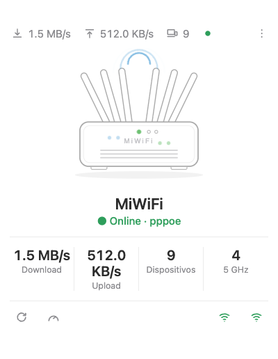

# MiWiFi Card

A Lovelace card for Xiaomi / MiWiFi routers exposed through the
[`ha_miwifi`](https://github.com/hudsonbrendon/ha-miwifi) integration.
Design and animation inspired by
[vacuum-card](https://github.com/denysdovhan/vacuum-card): an animated router
hero (pulsing Wi-Fi waves, blinking status LED, up/down data-flow particles),
a live status line, a stats grid, and a toolbar of actions.

<p align="center">
  
</p>

## Installation (HACS)

1. HACS → Frontend → ⋮ → Custom repositories.
2. Add `https://github.com/hudsonbrendon/miwifi-card`, category **Lovelace**.
3. Install "MiWiFi Card" and reload resources.

## Usage

The simplest config points at your router's **device prefix** — the slug
Home Assistant gives the device (e.g. a device named *Redmi AX6000* →
`redmi_ax6000`). The card auto-resolves every entity from it.

```yaml
type: custom:miwifi-card
entity: redmi_ax6000
name: Living Room Router
```

**Works in any Home Assistant language.** Auto-resolve matches entities by the
integration platform (`ha_miwifi`) and each entity's stable `translation_key`,
not by the localized `entity_id`. So `entity: miwifi` works even when your HA is
in Portuguese and the ids are `sensor.miwifi_velocidade_de_download` etc. — no
override needed. (If the entity registry can't be read, it falls back to the
English-name slug; use `entities:` overrides for any non-standard setup.)

### Options

| Option | Type | Default | Description |
|---|---|---|---|
| `entity` | string | — | Device prefix; auto-resolves all entities. Required unless `entities` is given. |
| `entities` | map | — | Per-key overrides (e.g. `download_speed: sensor.x`). Keys: see below. |
| `name` | string | `MiWiFi Router` | Card title. |
| `image` | string | built-in SVG | Custom hero image URL/path (disables the animated SVG). |
| `compact` | bool | `false` | Hide stats + toolbar. |
| `language` | string | HA locale | `en` or `pt-BR`. |
| `stats` | list | download/upload/devices/5 GHz | Up to 4 `{entity, subtitle, rate?, unit?, multiply?, precision?, suffix?}`. |
| `actions` | list | reboot + speedtest | Override the left toolbar group. |

Override keys for `entities`: `download_speed`, `upload_speed`,
`connected_devices`, `clients_24g`, `clients_5g`, `mesh_nodes`, `wan_ip`,
`wan_type`, `wan_uptime`, `firmware`, `wan_link`, `led`, `wifi_24g`,
`wifi_5g`, `reboot`, `speed_test`.

### Notes

- The **status LED** is shown read-only — the MiWiFi API does not allow
  toggling it, so the card reflects state and drives the LED animation but
  offers no on/off control.
- The hero animates only while the router is **online**
  (`binary_sensor.<dev>_wan_link == on`); it dims when offline and respects
  `prefers-reduced-motion`.

## Development

```bash
npm install
npm test        # vitest
npm run build   # → dist/miwifi-card.js
```
